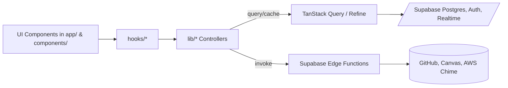
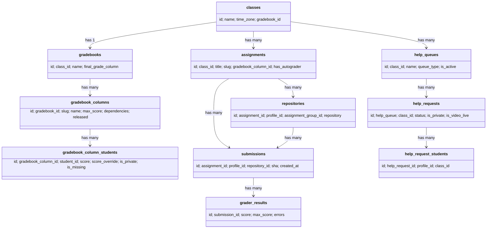
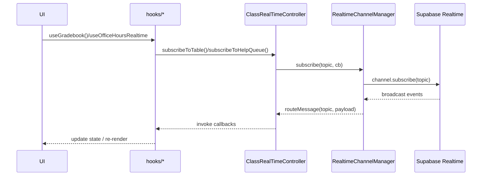
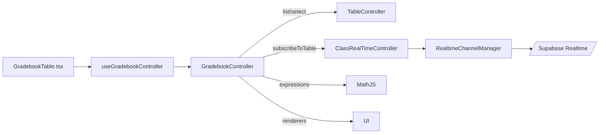
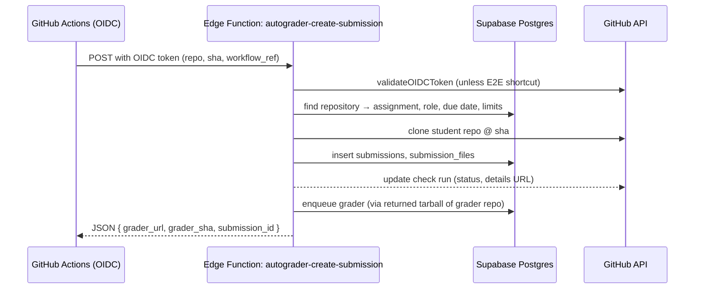
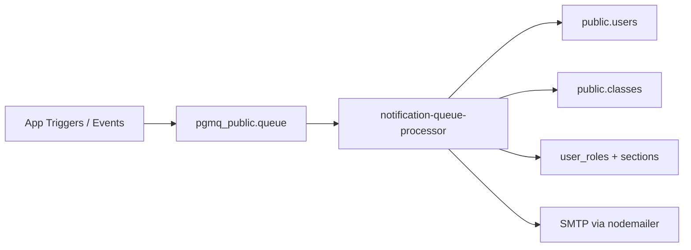
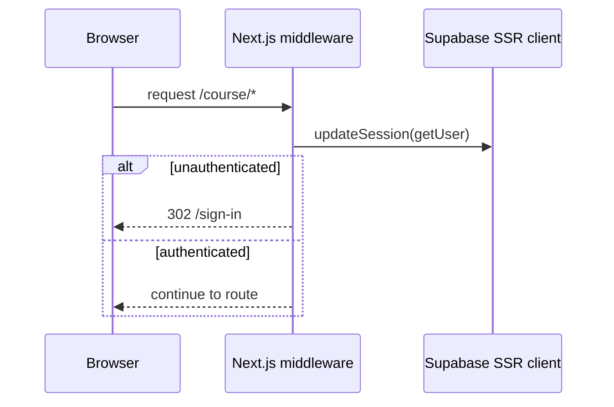

## Pawtograder Webapp – Developer Architecture Guide

This guide orients new developers to the codebase. It covers the tech stack, how data flows from database to UI, realtime, and the implementation of key features (Gradebook, Autograder, Office Hours/Meetings, Notifications). Diagrams are Mermaid for quick mental models.

### Tech stack at a glance
- **Framework**: Next.js (App Router) with React 18
- **UI**: Chakra UI (+ Radix primitives), Tailwind utilities, TanStack Table/Virtual, MDEditor/Markdown
- **State/Data**: Refine (`@refinedev/*`) + TanStack Query, custom controllers/hooks
- **Backend**: Supabase (Postgres + Auth + Realtime + Edge Functions/Deno), pgmq queue
- **Realtime**: Supabase Realtime channels (broadcast)
- **Integrations**: GitHub (Octokit, OIDC), AWS Chime SDK for video
- **Type safety**: Generated Supabase types (`utils/supabase/SupabaseTypes.d.ts`), domain helpers in `utils/supabase/DatabaseTypes.d.ts`

### Repository layout
- `app/` – Next.js routes, server/client components
- `components/` – UI components (GitHub, notifications, help queue, etc.)
- `hooks/` – Feature hooks and controllers glue code
- `lib/` – Core logic (realtime controllers, edge function clients, Chime wrappers)
- `supabase/functions/` – Edge Functions (Deno) for backend workflows
- `utils/supabase/` – Supabase client helpers, generated DB types, middleware



## Data model (essentials)
The full schema is large; generated types live in `utils/supabase/SupabaseTypes.d.ts`. Domain-focused helpers are in `utils/supabase/DatabaseTypes.d.ts`.

Key tables used by core features:
- Gradebook: `gradebooks`, `gradebook_columns`, `gradebook_column_students`
- Assignments & Submissions: `assignments`, `repositories`, `submissions`, `grader_results`, `submission_files`
- Office hours: `help_queues`, `help_requests`, `help_request_messages`, `help_request_students`, `video_meeting_sessions`
- Users & Roles: `users`, `profiles`, `user_roles`, `classes`, `class_sections`, `lab_sections`



## Realtime architecture
Realtime is centralized by `lib/RealtimeChannelManager.ts`, which exposes a singleton to avoid duplicate subscriptions and to handle reconnection/backoff. Two feature-specific controllers wrap it:
- `lib/ClassRealTimeController.ts`: class/user/submission channel orchestration
- `lib/OfficeHoursRealTimeController.ts`: help queue and help request channel orchestration

Channel topics (private channels):
- Class staff: `class:{class_id}:staff`
- Class user: `class:{class_id}:user:{profile_id}`
- Submission: `submission:{submission_id}:graders` and `submission:{submission_id}:profile_id:{profile_id}`
- Help queues: `help_queues`, `help_queue:{help_queue_id}`
- Help request: `help_request:{id}`, `help_request:{id}:staff`



Resilience features:
- Token refresh before (re)subscribe
- Exponential backoff, stuck-channel detection, and visibility/network listeners

## Gradebook feature
Entry points:
- UI: `app/course/[course_id]/manage/gradebook/gradebookTable.tsx`
- Hooks/controller: `hooks/useGradebook.tsx` defines `GradebookController`
- Data updates: realtime via `ClassRealTimeController` + table controllers

Highlights:
- Column dependencies are parsed from expressions (e.g., `gradebook_columns("slug*")`, `assignments("slug")`) using `mathjs`. See `GradebookController.extractAndValidateDependencies`.
- Rendering uses safe functions (`letter`, `check`, etc.) configured in `createRendererForColumn`.
- Grouped headers and virtualization for large rosters (TanStack Table + Virtual)



## Autograder pipeline
Implemented as Supabase Edge Functions under `supabase/functions/*` with GitHub OIDC. Core submission path: `autograder-create-submission`.



Notes:
- Security checks: workflow file SHA match, due date calculation (`calculate_final_due_date` RPC), rate limiting
- Errors recorded in `workflow_run_error`; user-visible vs private security errors are separated

## Office hours & meetings (AWS Chime)
Meeting page: `app/course/[course_id]/office-hours/[queue_id]/request/[help_request_id]/meet/meeting.tsx`
- Retrieves AWS Chime session via `lib/edgeFunctions.ts#liveMeetingForHelpRequest`
- Wraps UI with Chime providers (`MeetingProvider`, `VoiceFocusProvider`, background blur/replacement)
- Auto-closes when `help_request.is_video_live` flips false (realtime monitored by `useOfficeHoursRealtime`)

```mermaid
sequenceDiagram
  participant User
  participant UI as meeting.tsx
  participant EF as Edge Fn: live-meeting-for-help-request
  participant Chime as AWS Chime SDK

  User->>UI: opens /meet/ page
  UI->>EF: request Meeting, Attendee
  EF-->>UI: MeetingSessionConfiguration
  UI->>Chime: join + start via MeetingManager
  UI-->>User: roster, video tiles, controls
  UI->>UI: monitor is_video_live; close when false
```

## Notifications & email pipeline
`supabase/functions/notification-queue-processor` consumes a pgmq queue and sends emails via `nodemailer`.



- Template resolution with variable substitution (assignment links, thread links, sections)
- Archives processed messages back into pgmq

## External integrations
- **GitHub**: Classroom-like flows, repos per student/group, OIDC auth for actions, `@octokit/*`
- **Canvas**: `enrollments-sync-canvas` pulls enrollments by section and syncs users/roles
- **AWS Chime**: Video calls in office hours (providers & meeting manager wrappers under `lib/aws-chime-sdk-meeting/*`)

## Request lifecycle and auth
- `middleware.ts` + `utils/supabase/middleware.ts` keep Supabase sessions fresh, redirect unauthenticated users away from protected routes, and route authenticated users `/` → `/course`.



## Codegen and API clients
- OpenAPI codegen configured in `openapi-codegen.config.ts` to emit schema types and React Query components under `lib/generated/*` (source swagger.json expected at `../api/swagger.json`).
- Supabase DB types are generated with `npm run client`/`client-local`.

## How to trace a feature
- Find the App Route in `app/...` that renders the page
- Follow the hook(s) in `hooks/*` referenced by the page/component
- Examine the controller in `lib/*` for business logic and realtime subscriptions
- If it calls an Edge Function, see `lib/edgeFunctions.ts` for the invocation and `supabase/functions/*` for the implementation
- For DB shape, consult `utils/supabase/DatabaseTypes.d.ts` for curated types, and fall back to `SupabaseTypes.d.ts`

## Adding or modifying features
- Extend DB types: run `npm run client-local` for local dev or `npm run client` for remote
- Prefer adding controllers in `lib/*` that encapsulate queries, realtime, and expressions, then expose hooks in `hooks/*`
- Keep UI components presentational where possible (props-in, callbacks-out)
- For realtime: subscribe via the appropriate controller; avoid creating raw channels in components
- For autograder changes: consider repos, OIDC, and security checks together; update both EF logic and UI callers

---

Questions or missing context? Skim `README.md` for quickstart and reference external docs at `https://docs.pawtograder.com/`.