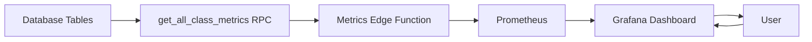

# Pawtograder Metrics System

This document provides a comprehensive overview of the Pawtograder metrics system and instructions for adding new metrics.

## Architecture Overview

The metrics system consists of three main components:

1. **Database RPC Function** (`get_all_class_metrics`) - Aggregates data from database tables
2. **Edge Function** (`/supabase/functions/metrics/`) - Serves metrics in Prometheus format
3. **Grafana Dashboard** - Visualizes metrics with filtering capabilities



## Current Metrics Categories

### 🔄 Workflow Performance

- **Workflow runs** (total, completed, failed, in-progress, timeout)
- **Performance timing** (avg queue time, avg run time)
- **Error tracking** (total workflow errors)

### 👥 User Engagement

- **User counts** (students, instructors, graders)
- **Activity tracking** (students active 24h/7d)
- **Engagement rates** (calculated in Grafana)

### 📝 Submissions & Grading

- **Submission activity** (total, recent 24h, graded, pending)
- **Grading performance** (reviews completed, turnaround time)
- **Comment volume** (all submission comment types combined)

### 🆘 Support & Communication

- **Help requests** (total, open, resolved, avg resolution time)
- **Help request messages** (total communication volume)
- **Discussion activity** (threads, recent posts)

### 📹 Video Meetings & Office Hours

- **Meeting usage** (sessions, participants, unique users)
- **Meeting quality** (average duration)
- **Recent activity** (7-day metrics)

### 🚨 System Health & Issues

- **Regrade requests** (total, recent activity)
- **Late token usage** (total used, percentage of limit)
- **System complexity** (gradebook columns count)
- **SIS sync errors** (current error state)
- **Notifications** (unread count)

### 📊 Assignment Management

- **Assignment status** (total, active vs inactive)
- **Assignment distribution** (per class)

## Component Details

### 1. Database RPC Function

**Location**: `supabase/migrations/20250830021125_enhance_metrics.sql`

The `get_all_class_metrics()` function:

- Runs as `SECURITY DEFINER` with `service_role` access only
- Loops through all non-archived classes
- Executes SQL queries to aggregate metrics from various tables
- Returns JSON object with all metrics per class

**Key Features**:

- Idempotent migration (can be re-applied safely)
- Proper search_path hardening for security
- Comprehensive error handling
- Efficient single-query approach per class

### 2. Edge Function

**Location**: `supabase/functions/metrics/index.ts`

The metrics endpoint:

- Calls the `get_all_class_metrics()` RPC function
- Transforms data into Prometheus format
- Provides Bearer token authentication (optional)
- Includes proper error handling and Sentry integration

**Key Features**:

- TypeScript interface for type safety
- Prometheus-compatible output format
- Configurable authentication
- Comprehensive metric labeling (class_id, class_name, class_slug)

### 3. Grafana Dashboard

**Location**: `grafana-dashboard-pawtograder-metrics.json`

The dashboard provides:

- Interactive filtering by class_slug and class_name
- Multiple visualization types (time series, bar gauges, pie charts, stats)
- Organized sections with collapsible rows
- Color-coded thresholds for health indicators
- Auto-refresh capabilities

**Key Features**:

- Datasource variable for easy configuration
- Class filtering with human-readable labels
- Responsive layout with proper grid positioning
- Smart calculations (engagement rates, success rates, etc.)

## Adding New Metrics

Follow these steps to add a new metric to the system:

### Step 1: Database RPC Function

Example in `supabase/migrations/20250830021125_enhance_metrics.sql`, but be sure to use the latest version:

```sql
-- Add your new metric to the jsonb_build_object call
'your_new_metric_name', (
  SELECT COUNT(*) FROM "public"."your_table"
  WHERE class_id = class_record.id
    AND your_conditions = 'your_value'
),
```

**Guidelines**:

- Use descriptive metric names (e.g., `help_request_messages_total`)
- Include appropriate WHERE clauses for class filtering
- Use `COALESCE()` for calculations that might return NULL
- Consider time-based filtering for recent activity metrics
- Use proper data types (`integer` vs `bigint` casting when needed)

### Step 2: TypeScript Interface

Edit `supabase/functions/metrics/index.ts`:

1. **Add to ClassMetrics interface**:

```typescript
interface ClassMetrics {
  // ... existing metrics
  your_new_metric_name: number;
}
```

2. **Add to data mapping**:

```typescript
// Convert the JSON response to our metrics format
const metrics: ClassMetrics[] = metricsData.map((classData: ClassMetrics) => ({
  // ... existing mappings
  your_new_metric_name: classData.your_new_metric_name || 0
}));
```

3. **Add to Prometheus output**:

```typescript
// Add in the appropriate section
generateMetric(
  "pawtograder_your_new_metric_name",
  "Description of what this metric measures",
  "counter", // or "gauge" - see metric types below
  "your_new_metric_name"
);
```

### Step 3: Grafana Dashboard

Edit `grafana-dashboard-pawtograder-metrics.json`:

1. **Add new panel** in the appropriate section:

```json
{
  "fieldConfig": {
    "defaults": {
      "color": {"mode": "thresholds"},
      "thresholds": {
        "steps": [
          {"color": "green", "value": null},
          {"color": "yellow", "value": 10},
          {"color": "red", "value": 50}
        ]
      },
      "unit": "short"
    }
  },
  "gridPos": {"h": 8, "w": 8, "x": 0, "y": NEXT_Y_POSITION},
  "id": NEXT_ID,
  "targets": [{
    "expr": "sum by (class_slug, class_name) (pawtograder_your_new_metric_name{class_slug=~\"$class_slug\", class_name=~\"$class_name\"})",
    "legendFormat": "{{class_name}}"
  }],
  "title": "Your Metric Title",
  "type": "timeseries" // or "bargauge", "stat", "piechart"
}
```

2. **Update grid positions** for subsequent panels by incrementing their `y` values

## Metric Types

### Counter vs Gauge

**Use Counter when**:

- Value only increases over time
- Represents cumulative totals
- Examples: `submissions_total`, `workflow_runs_total`, `help_requests_total`

**Use Gauge when**:

- Value can go up or down
- Represents current state or recent activity
- Examples: `help_requests_open`, `students_active_24h`, `sis_sync_errors_recent`

### Time-based Metrics

For recent activity metrics, use consistent time windows:

- `*_recent_24h` - Last 24 hours
- `*_recent_7d` - Last 7 days
- `*_recent_30d` - Last 30 days (for averages)

## Database Schema Considerations

### Required Columns

Ensure your source tables have:

- `class_id` (bigint) - Links to the classes table
- `created_at` (timestamp) - For time-based filtering
- Appropriate indexes for query performance

### Data Type Casting

Be aware of data type mismatches:

- `classes.id` is `bigint`
- `user_roles.class_id` is `integer` (requires casting: `class_record.id::integer`)

### Foreign Key Relationships

Ensure proper foreign key constraints exist:

```sql
CONSTRAINT "your_table_class_id_fkey"
FOREIGN KEY ("class_id") REFERENCES "public"."classes"("id") ON DELETE CASCADE
```

## Security Considerations

### RLS Policies

The metrics RPC function uses `SECURITY DEFINER` and runs as `service_role` to bypass RLS. This is necessary for system-wide metrics collection. When you delete and recreate it, make sure to include all the latest policies and permissions.

### Authentication

The metrics endpoint supports optional Bearer token authentication via the `METRICS_TOKEN` environment variable.

### Data Privacy

Metrics aggregate data at the class level and don't expose individual user information. Personal data is never included in metrics output.

## Performance Optimization

### Query Optimization

- Use appropriate indexes on frequently queried columns
- Consider materialized views for expensive calculations
- Use `COALESCE()` to handle NULL values efficiently
- Limit time-based queries with appropriate intervals

### Caching

The metrics endpoint includes cache headers:

```
Cache-Control: no-cache, no-store, must-revalidate
```

Consider implementing caching at the Prometheus/Grafana level if needed.

### Monitoring

Monitor the metrics endpoint performance:

- Query execution times
- Memory usage
- Error rates
- Response sizes

## Testing

### Database Testing

Test your RPC function changes:

```sql
-- Test the function directly
SELECT get_all_class_metrics();

-- Test specific class metrics
SELECT * FROM get_all_class_metrics()
WHERE (value->>'class_id')::bigint = YOUR_CLASS_ID;
```

### Edge Function Testing

Test the metrics endpoint:

```bash
# Local testing
curl http://localhost:54321/functions/v1/metrics

# With authentication
curl -H "Authorization: Bearer YOUR_TOKEN" \
     http://localhost:54321/functions/v1/metrics
```

### Grafana Testing

1. Import the updated dashboard JSON
2. Verify datasource configuration
3. Test class filtering functionality
4. Validate metric calculations and thresholds

## Deployment

### Migration Deployment

The migration is idempotent and can be safely re-applied:

```bash
supabase db push
```

### Edge Function Deployment

Deploy the updated metrics function:

```bash
supabase functions deploy metrics
```

### Grafana Dashboard

Import the updated dashboard JSON file through the Grafana UI or API.

## Troubleshooting

### Common Issues

1. **Missing metrics in Prometheus**

   - Check RPC function syntax
   - Verify TypeScript interface mapping
   - Ensure Prometheus metric generation

2. **Empty Grafana panels**

   - Verify datasource configuration
   - Check Prometheus query syntax
   - Validate metric names match exactly

3. **Performance issues**

   - Review query execution plans
   - Check for missing indexes
   - Consider query optimization

4. **Authentication errors**
   - Verify METRICS_TOKEN environment variable
   - Check Bearer token format
   - Validate service_role permissions

### Debug Queries

```sql
-- Check class data
SELECT id, name, slug FROM classes WHERE archived = false;

-- Test specific metric queries
SELECT COUNT(*) FROM your_table WHERE class_id = YOUR_CLASS_ID;

-- Verify RPC function permissions
SELECT has_function_privilege('service_role', 'get_all_class_metrics()', 'execute');
```

## Contributing

When adding new metrics:

1. Follow the naming conventions (`category_metric_timeframe`)
2. Add appropriate documentation
3. Include proper error handling
4. Test thoroughly in development
5. Update this documentation
6. Consider the impact on query performance

## Future Improvements

Potential enhancements to consider:

- **Metric aggregation** - Cross-class summaries and averages
- **Historical data** - Trend analysis and time-series storage
- **Alerting** - Automatic notifications for threshold breaches
- **Custom dashboards** - Per-instructor or per-course views
- **API endpoints** - RESTful access to specific metrics
- **Real-time updates** - WebSocket or SSE for live data

---

For questions or issues with the metrics system, please refer to the development team or create an issue in the project repository.
