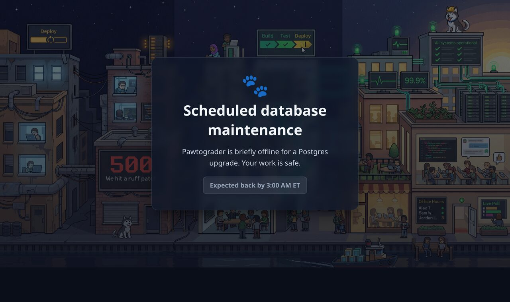

# Planned Maintenance (Postgres)

How to take Pawtograder down for **planned** work that touches the database node
— a Kubernetes node drain, a kernel/host reboot, a storage migration, or any
maintenance where the primary Postgres pod must move or restart. The standing
guidance is a **short, scheduled, full-downtime window**, not a read-only or a
failover dance. This runbook says why, and gives the procedure.

Scope: the `supabase/postgres` StatefulSet deployed by `charts/pawtograder`. `NS`
is the release namespace, `<release>` the Helm release. For an **unplanned**
primary loss (the primary is gone and not coming back) use the promote path in
[point-in-time-recovery.md](./point-in-time-recovery.md#manual-failover-promote-the-standby)
instead — this doc is the _planned_ case.



_The styled maintenance page (served with `HTTP 503` + `Retry-After`), captured from staging. Title/message/ETA are set per-window with `maintenance.sh down --title/--message/--eta`._

---

## Why a full-downtime window, not read-only

The tempting move is to keep the app up read-only against the standby while the
primary bounces. For Pawtograder that is a trap: **read-only Postgres is
effectively "system unavailable", but unpredictably so.** The core user actions
— submitting, autograder result writes, grade and regrade saves, help-queue
updates, and even auth/session writes — are all writes. Under a read-only
database they fail _scattered across the UI_: some pages load, then an action
500s with `cannot execute INSERT in a read-only transaction`. That is a worse,
more confusing experience than a clean maintenance page, and it generates more
support load, not less.

So we prefer honest downtime: put up a maintenance page that says when we'll be
back, take the short hit, and come back whole. Reads _and_ writes resume
together, with no half-working surface in between.

The standby stays **out of the planned path entirely.** Its job is unplanned
failover and PITR (see [point-in-time-recovery.md](./point-in-time-recovery.md)),
not planned maintenance — a planned bounce needs no promotion, no service
repoint, and no post-failover rebuild.

---

## What makes the bounce safe and cheap

Two chart features turn a node drain into a clean primary bounce rather than a
wedge or a corruption risk:

- **`postgres.pdb.enabled` → a `maxUnavailable: 1` PodDisruptionBudget**
  (`templates/pdb.yaml`). Over a single replica, `minAvailable: 1` would allow
  _zero_ voluntary disruptions and `kubectl drain` would hang on the primary
  forever; `maxUnavailable: 1` allows exactly one, so the eviction API lets the
  primary move.
- **The postgres preStop fast-shutdown** (`templates/postgres-statefulset.yaml`),
  which issues a fast Postgres shutdown on SIGTERM so the pod stops promptly and
  cleanly instead of being SIGKILLed at the end of the grace period.

Together, a node drain **evicts the primary, and the StatefulSet reschedules it
onto another node, reattaches its PVC, and it comes back _as itself_** — same
StatefulSet identity, same data volume, same primary. No promotion, no timeline
branch, no rebuild. The standby simply reconnects and resumes streaming from
where it left off (or `wal-g wal-fetch`es the gap from the archive if it fell
behind the primary's retained `pg_wal`).

> Enable the PDB in the environment overlay. It is off by default (single-replica
> components skip PDBs unless an install explicitly wants drains to stop at the
> database):
>
> ```yaml
> postgres:
>   pdb:
>     enabled: true
> ```

---

## Scheduling

Pawtograder is a course tool: an outage during an assignment deadline or an exam
is a real incident, not an inconvenience. Before scheduling:

- **Avoid deadlines and exam windows.** Check the active courses' due dates and
  in-class assessment times; a couple of minutes of downtime at the wrong minute
  is a lot of students at once.
- Prefer **early morning** in the courses' primary time zone, when submission and
  help-queue traffic is lowest.
- **Announce it** to course staff ahead of time with the window and expected
  duration.

---

## Procedure

The window is dominated by the primary pod reschedule + Postgres restart —
budget a **couple of minutes** of write downtime, a bit more if the image must
pull on the new node.

### Recommended: drive it with `maintenance.sh`

`charts/pawtograder/scripts/maintenance.sh` wraps the page-up + write-fence
sequence below with live status output and exact-restore state capture. Use it as
the primary path; the numbered steps that follow are the underlying reference (and
the fallback if you need to do it by hand). Its `down` does, in order: pause
pg_cron → (page up + scale every writer tier to 0, in one fence) → suspend
write CronJobs → block until all writer pods terminate → report SAFE TO BOUNCE /
NOT READY. `up` is the reverse (writable preflight → restore writers/channels →
unsuspend CronJobs → re-apply the functions HPA → resume pg_cron → drop the page
last).

```bash
# 1. Pre-stage the page once (creates the Service; does NOT reroute yet):
helm upgrade pawtograder <chart> -n pawtograder-prod --reuse-values \
  --set maintenance.enabled=true

# 2. Page up + fence all writers, then read the SAFE TO BOUNCE / NOT READY line:
charts/pawtograder/scripts/maintenance.sh down            # add --dry-run to preview
#    ...perform the node/DB maintenance once it says SAFE TO BOUNCE...

# 3. Restore everything (page comes down LAST):
charts/pawtograder/scripts/maintenance.sh up

charts/pawtograder/scripts/maintenance.sh status          # read-only posture, any time
```

`down` captures prior state (active `cron.job` rows, the edge-functions HPA,
writer replica counts, suspended CronJobs, the ingress web-host backend) into the
`pawtograder-maintenance-state` ConfigMap; `up` restores from it and deletes it.
`NAMESPACE`/`RELEASE` are configurable (`-n`/`-r`, default `pawtograder-prod` /
`pawtograder`); `--yes` skips the prompt.

**Facts the write-fence audit surfaced (why the script does more than scale pods):**

- **The page is not a write fence.** The ingress patch reroutes the **web host
  only**; the **API/kong host stays open**, so the database is still reachable
  until the writer tiers are actually stopped. So is `supavisor`'s pooled
  Postgres port — `<release>-supavisor` on `:6543` — which the fence leaves
  running on purpose (a pooler originates no writes, it proxies them), so any
  in-cluster client still holding a pooled connection can keep writing for the
  whole window.
- **Writes come from more than the obvious tiers.** `auth` (GoTrue) writes
  sessions on every request; `edge-functions` is HPA-managed (delete the HPA, for
  the reason step 1 gives — which is _not_ that a `kubectl scale --replicas=0`
  gets undone); `meta` and `studio` hold direct superuser connections behind
  Studio's SQL editor; and **`pg_cron`** fires DB-side jobs (gradebook
  recalculation, deadline checks, sync) with no pod to scale — pause them with
  `UPDATE cron.job SET active=false`.
- **The real gate is "zero writer pods", not "empty queue".** Everything is
  fenced in one step — page up + scale **all** writer tiers to 0 (`functions` incl.
  its HPA, `web`, `rest`, `auth`, `storage`, `realtime`, and channel deploys) —
  and the script then blocks until those pods have **terminated**. Scaling
  `functions` to 0 lets in-flight handlers COMMIT and exit cleanly because
  edge-runtime drains on SIGTERM up to `edgeFunctions.gracefulExitTimeoutSeconds`
  (410s ≥ `worker.timeoutMs` 400s), exiting as soon as in-flight is done
  (near-instant when idle); `terminationGracePeriodSeconds` (430s) is only the
  SIGKILL backstop. Once no writer pod is running, nothing is touching the DB.
- **The pgmq backlog is durable, so it is NOT a gate.** The queues
  (`pgmq.q_async_calls`, `q_async_calls_low_priority`, `q_gradebook_row_recalculate`,
  `q_discord_async_calls`) are Postgres tables — the backlog survives the bounce and
  drains after `up` when `functions` resumes. The script prints the buffered count
  as context but does **not** block on it: safety comes from graceful-exit +
  zero writer pods, and blocking on 0 would never converge anyway because the
  api/kong host stays open and webhooks (e.g. `github-repo-webhook`) keep writing
  directly.
- Write-capable **CronJobs** (`audit-partitions`, the backup drills) are suspended
  for the window and restored afterward.
- **`meta` and `studio` are writers too, and `maintenance.sh` does not scale
  them.** Both hold a direct Postgres connection as the `postgres` superuser
  (`meta`'s `PG_META_DB_*`, `studio`'s `POSTGRES_HOST`/`POSTGRES_PASSWORD`, both
  from `secrets.names.postgres`) to serve Studio's Database and SQL-editor pages,
  so an operator with a Studio tab open can commit DDL through a fence that
  counted only app tiers. It needs a live session, so the likelihood is low and
  the fix is two words in a regex — which the manual sequence below now has. The
  script's `STABLE_WRITERS` list does **not** yet: until it does, scale
  `<release>-meta` and `<release>-studio` to 0 by hand when you drive the window
  with `maintenance.sh`.

### Manual reference sequence

> **Before step 1: stop anything that can redeploy the release mid-window.** The
> fence is a set of hand-made `spec.replicas: 0` values, a deleted HPA and four
> suspended CronJobs. **A single `helm upgrade` puts all of it back in one
> reconcile** — the unblock note under step 3 says exactly that, and the reason it
> stops the drain first is that a `fenced` re-check can only _report_ restored
> writers afterwards; it cannot pause a drain that is already evicting. The drain
> itself is minutes long, so this is not a theoretical race.
>
> **Nothing below pauses that, and a runbook edit cannot pause it for you** — what
> to pause depends on the deploy path, and the two paths fail differently:
>
> - **Push-based (Khoury production).** `prod-charts` deploys by a manually
>   dispatched GitHub Actions workflow running `helm upgrade --install`; nothing
>   reconciles on a timer, so the hazard is a _concurrent human deploy_, not a
>   controller. Announce the window to everyone who can dispatch it, and if you
>   can, gate the workflow for its duration (a required-reviewer environment, or
>   simply telling people and watching the Actions tab).
> - **Continuously reconciled (Fleet / Argo CD / Flux).** Here the writers come
>   back on their own, inside one sync interval, whether or not anybody touches
>   anything — so this is not optional. Suspend the sync source **before** step 1:
>
>   ```bash
>   # Rancher Fleet:
>   kubectl -n <fleet-ns> patch gitrepo <name> --type=merge -p '{"spec":{"paused":true}}'
>   # Flux:
>   flux suspend kustomization <name>
>   # Argo CD:
>   argocd app set <app> --sync-policy none
>   ```
>
>   Resume in step 5, **after** the writers are restored (`paused:false` /
>   `flux resume kustomization` / `--sync-policy automated`). A resume that lands
>   before the restore just performs the restore for you, from committed state, at
>   a moment you did not choose.
>
> Either way, **write down what you paused.** An un-resumed sync source is a
> silent config-drift outage days later that looks nothing like this window.

1. **Put up the maintenance page, then fence writes.** The chart ships a styled
   maintenance page (`maintenance.enabled`) — a tiny nginx Deployment behind the
   `pawtograder-maintenance` Service that returns HTTP 503 + `Retry-After` with an
   on-brand "we'll be right back" body. You route the **web host** to it so users
   see a clean banner instead of errors.

   **Deploy the page first — it must exist before you reroute.** Enabling
   `maintenance.enabled` only _creates_ the Deployment/Service; the ingress patch
   is what reroutes. Roll it out and wait for endpoints:

   ```bash
   helm upgrade pawtograder <chart> -n "$NS" --reuse-values \
     --set maintenance.enabled=true \
     --set maintenance.eta="6:15pm ET"   # optional; title/message also overridable
   kubectl -n "$NS" rollout status deploy/pawtograder-maintenance
   ```

   **Reroute the web host → maintenance page.** The primary ingress is named
   `pawtograder` (the Helm fullname); its first rule (`rules[0]`) is the web host,
   and with the API on its own host (prod default) that rule's first path
   (`paths[0]`) is the web backend. Verify the rule is the web host, then repoint
   it:

   ```bash
   # Confirm rules[0] is the WEB host (not the api host) before patching:
   kubectl -n "$NS" get ingress pawtograder -o jsonpath='{.spec.rules[0].host}{"\n"}'

   kubectl -n "$NS" patch ingress pawtograder --type=json -p \
     '[{"op":"replace","path":"/spec/rules/0/http/paths/0/backend/service","value":{"name":"pawtograder-maintenance","port":{"number":8080}}}]'
   ```

   > **Restore every patched field to its exact prior value.** Under server-side
   > apply, `kubectl patch`/`scale` take ownership of the fields they touch, and
   > reverting the value does not release that claim. Ownership alone is harmless:
   > SSA raises a conflict only when a later apply would **change** a field owned
   > by someone else. So the rule that matters is byte-exactness. If what you
   > restore differs from what the chart renders, even by one character, the next
   > `helm upgrade` fails:
   >
   > ```
   > UPGRADE FAILED: conflict occurred while applying object ...
   >   Apply failed with 1 conflict: conflict with "kubectl-patch" using v1: .data.index.html
   > ```
   >
   > and it fails on a deploy that may be days later and unrelated to the window.
   >
   > `--field-manager=helm` does **not** avoid this. Verified in production, it
   > only changes the name in the message to `conflict with "helm"`, because a
   > manager's `Update` entry is distinct from Helm's `Apply` entry. The escape
   > hatch is to force ownership back to Helm on the next server-side apply,
   > after confirming the live value is the one you want:
   >
   > ```bash
   > helm upgrade <release> <chart> -n "$NS" -f <values> --server-side --force-conflicts
   > ```
   >
   > `--force-conflicts` and `--server-side` are Helm 4 flags. Stock Helm 3
   > `helm upgrade` has neither and rejects `--force-conflicts` as an unknown flag.
   > On a GitOps/Fleet deploy path, force via the wrapper's own flag or re-apply
   > input.

   **This reroutes the web host ONLY — it is not a write fence.** The API/kong
   host is a separate ingress rule and stays open — and so is the pooler's
   `<release>-supavisor` Service on `:6543`, which the fence deliberately leaves
   up, so an in-cluster client holding a pooled connection can still write. The
   page is a user-facing banner, not protection for the database. Fencing writes
   is a separate step, and scaling Deployments to zero does **not** by itself stop
   every writer:

   - **auth** (GoTrue) writes sessions/refresh tokens on every request — it is a
     database writer, so a scale list that omits it leaves auth traffic writing.
   - **edge-functions** is HPA-managed. `kubectl scale --replicas=0` is _not_
     immediately undone — with `spec.replicas: 0` and `minReplicas` non-zero the
     HPA controller reports `ScalingActive=False` / `ScalingDisabled` and stops
     acting on the target; scaling back _off_ zero is what needs the alpha
     `HPAScaleToZero` gate, and prod runs v1.32.13 without it. Delete the HPA
     anyway, because nothing may be able to **re-arm** it: see step 1's comment.
   - per-course **channel** Deployments (`<release>-web-<channel>`,
     `<release>-functions-<channel>`) are not in any fixed name list.
   - **meta** and **studio** connect to Postgres directly as the `postgres`
     superuser to serve Studio's Database and SQL-editor pages, so a tier list
     built from "the app" misses them.

   So to actually fence writes, **record current replica counts, delete the HPA,
   and scale the writer tiers to 0**, so you can restore them exactly in step 5:

   ```bash
   # RUN THE WHOLE FENCE AS ONE COMMAND. `set -euo pipefail` in a subshell is the
   # point: every step here had a failure mode that was advisory, and this
   # procedure's whole claim is that nothing writes to the primary while it is
   # bounced. Inside `set -e` the sequence STOPS at the first failure and the
   # block exits non-zero, so a fence that broke halfway cannot look like a fence
   # that completed.
   (
     set -euo pipefail

     # 0. Pause pg_cron FIRST. ~20 scheduled jobs write in-DB every minute,
     #    independent of every app pod, so scaling Deployments alone does NOT
     #    fence them. Record the active set so you can resume exactly in step 5.
     #    Then VERIFY the pause took: this psql can fail for reasons that leave
     #    the jobs running (wrong pod name after a rename, RBAC on exec, a
     #    primary that is not `-0`), and a fence that silently skipped its
     #    in-database writers is the worst version of this failure -- the app
     #    pods are all gone, so everything looks quiet.
     kubectl -n "$NS" exec <release>-postgres-0 -c postgres -- psql -U supabase_admin \
       -d postgres -tAc "SELECT string_agg(jobid::text,',') FROM cron.job WHERE active;"
     kubectl -n "$NS" exec <release>-postgres-0 -c postgres -- psql -U supabase_admin \
       -d postgres -c "UPDATE cron.job SET active=false WHERE active;"
     #    The count is read WITHOUT a `| tr` pipeline. `set -o pipefail` is in
     #    force here so a pipeline WOULD abort (verified: exec rc=1 -> block
     #    rc=1, nothing scaled) -- but the same line copied out of this subshell
     #    into `fenced()`, where pipefail is not in force, is exactly how the
     #    swallowed-exit-status bug got in. Both forms are written the same way so
     #    the next copy is safe wherever it lands.
     still_active="$(kubectl -n "$NS" exec <release>-postgres-0 -c postgres -- psql -U supabase_admin \
       -d postgres -tAc "SELECT count(*) FROM cron.job WHERE active;")"
     still_active="${still_active//[[:space:]]/}"
     if [ "$still_active" != "0" ]; then
       echo "STOP: $still_active pg_cron job(s) are still active -- in-database writers are NOT fenced." >&2
       exit 1
     fi

     # 1. Record what to restore, and record it BEFORE anything is mutated:
     #    writer Deployments + the realtime StatefulSet (kind, name, component
     #    and desired replicas -- a `-o wide` snapshot is not machine-readable,
     #    and the component column is what lets the restore loop re-check this
     #    file against the same allowlist) and the
     #    edge-functions HPA. Step 5 restores from this file, so what is in it is
     #    exactly what step 5 will scale.
     #
     #    FILTER THE CAPTURE THROUGH THE SAME ALLOWLIST THE FENCE USES. It was
     #    `get deploy,statefulset -l instance=<release>` with no component
     #    filter, which is release-wide -- so it recorded `postgres`,
     #    `postgres-replica`, `kong`, `supavisor`, `maintenance`, `imgproxy`,
     #    `smtp-relay` and `redis` too, and the restore step then set every one
     #    of them to its fence-time replica count. Three lines of comment above
     #    claimed it recorded "writer Deployments + the realtime StatefulSet";
     #    the code did something else. Here that meant step 5 setting the postgres
     #    StatefulSet back to its fence-time replicas -- harmless only because it
     #    was never scaled down; on the promote path in point-in-time-recovery.md
     #    the identical capture restarted the abandoned old primary.
     #    Recording only what the fence scales makes the restore structurally
     #    incapable of touching anything else.
     #
     #    `-l app.kubernetes.io/instance=<release>` still scopes it to THIS
     #    release, so an unrelated workload sharing the namespace is neither
     #    recorded nor "restored".
     #
     #    `mktemp -d`, not `/tmp/pg-maint-$(date +%s)`: two runs started in the
     #    same second shared one directory, and the restore step's `ls -dt |
     #    head -1` could then hand you an EARLIER run's state. The META file is
     #    how the restore step proves it is reading the right run's directory
     #    rather than trusting mtime.
     STATE_DIR="$(mktemp -d "/tmp/pg-maint-XXXXXXXX")"
     {
       echo "procedure: planned-maintenance (postgres node bounce)"
       echo "release: <release>"
       echo "namespace: $NS"
       echo "started: $(date -Is)"
       echo "operator: ${USER:-unknown}@$(hostname)"
     } > "$STATE_DIR/META"
     jpr='{range .items[*]}{.kind}{"\t"}{.metadata.name}{"\t"}{.metadata.labels.app\.kubernetes\.io/component}{"\t"}{.spec.replicas}{"\n"}{end}'
     # NOTE the redirect stays on the awk line. A continuation line that STARTS
     # with `>` is a shell redirect to markdown and a blockquote marker to
     # anything that strips prefixes -- including this repo's own block-extraction
     # harness, which ate it and silently verified a pipeline with no output file.
     kubectl -n "$NS" get deploy,statefulset -l "app.kubernetes.io/instance=<release>" -o jsonpath="$jpr" \
       | awk -F'\t' -v OFS='\t' '$3 ~ /^(web|rest|auth|storage|functions|realtime|meta|studio)(-.+)?$/ { print $1, $2, $3, $4 }' > "$STATE_DIR/replicas.txt"
     # awk exits 0 on no matches, so the empty case needs its own guard -- the
     # same "matched nothing" shape as the fence's NOTHING MATCHED below.
     if [ ! -s "$STATE_DIR/replicas.txt" ]; then
       echo "STOP: recorded ZERO writer workloads -- wrong release name or namespace. Nothing to restore later; do not proceed." >&2
       exit 1
     fi
     kubectl -n "$NS" get hpa -l "app.kubernetes.io/instance=<release>" -o yaml > "$STATE_DIR/hpa.yaml"
     printf '\n>>> STATE_DIR=%s <<<  step 5 needs this EXACT path. Write it down.\n\n' "$STATE_DIR"

     # 2. DELETE the edge-functions HPA (recorded above), then scale the writer
     #    tiers to 0. It cannot be "paused" instead: minReplicas:0 needs the
     #    HPAScaleToZero gate and maxReplicas:0 is rejected outright.
     #
     #    Delete it for the RIGHT reason. `kubectl scale --replicas=0` is not
     #    undone by the HPA: with `spec.replicas: 0` and `minReplicas` non-zero
     #    the controller reports `ScalingActive=False` / `ScalingDisabled` and
     #    stops acting on the target (scaling back OFF zero is what needs
     #    HPAScaleToZero; prod runs v1.32.13 without it). The fence would hold on
     #    its own. What the delete buys is that nothing can RE-ARM it: the instant
     #    something sets `spec.replicas` off zero — a partial restore, a deploy
     #    run, a controller reconcile — a live HPA drives the tier straight back
     #    toward `minReplicas`, un-fencing it with no operator action and no log
     #    line an operator would look at. (Reasoned from the controller's
     #    documented scale-to-zero behaviour, not measured: measuring it means
     #    scaling prod.)
     #    `--ignore-not-found` because an install with autoscaling off has no HPA
     #    and a NotFound here would abort a fence that is otherwise fine; unlike
     #    `scale`, `delete` really does take that flag.
     kubectl -n "$NS" delete hpa <release>-functions --ignore-not-found

     # ONE enumeration for every writer, by NAME. Three separate holes are being
     # closed here and they were all the same shape -- `kubectl scale -l
     # <selector>` prints "No resources found" and exits 0 when nothing matches:
     #   * `for c in rest auth storage` scaled by exact component label, so a
     #     label change skipped a tier without failing.
     #   * `scale statefulset -l component=realtime` skipped realtime the same way.
     #   * the previous `-l app.kubernetes.io/name=pawtograder` selector matched
     #     NOTHING at all on an install with `nameOverride` set, because
     #     `pawtograder.name` stamps the override into that label.
     # Selecting on app.kubernetes.io/INSTANCE (the release name, which nothing
     # overrides) and filtering by component regex covers the stable web and edge
     # tiers, the background-worker tier (component=functions-workers) and every
     # per-course channel (functions-<channel>, web-<channel>) in one pass. The
     # regex is what keeps this from being the whole-release selector: it excludes
     # `maintenance` (the page you are about to serve), `kong`, `postgres` and
     # `supavisor`.
     #
     # `meta` and `studio` ARE in the regex, and were not until 2026-09-03. Both
     # hold a direct Postgres connection as the `postgres` superuser (meta's
     # PG_META_DB_*, studio's POSTGRES_HOST/POSTGRES_PASSWORD, both from
     # `secrets.names.postgres`) to serve Studio's Database and SQL-editor pages,
     # so an operator with a Studio tab open could commit DDL straight through a
     # fence that counted only app tiers. It needs a live session, so the
     # likelihood is low -- and the fix is two words in a regex.
     #
     # `supavisor` stays OUT on purpose: it originates no writes of its own, it
     # proxies them. But that means its pooled Postgres port stays reachable
     # (`<release>-supavisor` :6543) for the whole window, so any in-cluster
     # client still holding a pooled connection can keep writing. Nothing the
     # chart renders uses it by default; a bespoke workload might.
     jp='{range .items[*]}{.metadata.labels.app\.kubernetes\.io/component}{" "}{.metadata.name}{"\n"}{end}'
     WRITE_DEPLOY="$(kubectl -n "$NS" get deploy -l "app.kubernetes.io/instance=<release>" -o jsonpath="$jp" \
       | awk '$1 ~ /^(web|rest|auth|storage|functions|meta|studio)(-.+)?$/ { print "deploy/" $2 }')"
     WRITE_STS="$(kubectl -n "$NS" get statefulset -l "app.kubernetes.io/instance=<release>" -o jsonpath="$jp" \
       | awk '$1 ~ /^realtime(-.+)?$/ { print "statefulset/" $2 }')"
     WRITERS="$(printf '%s\n%s\n' "$WRITE_DEPLOY" "$WRITE_STS" | awk 'NF')"

     printf '%s\n' "$WRITERS"   # eyeball it first: this list IS the fence
     if [ -z "$WRITERS" ]; then
       echo "NOTHING MATCHED -- wrong release name or namespace. NOT fenced; do not proceed." >&2
       exit 1
     fi
     # shellcheck disable=SC2086  # deliberate word-splitting: one kubectl call, N targets
     kubectl -n "$NS" scale $WRITERS --replicas=0

     # 3. SUSPEND the write-capable CronJobs. The summary above lists "suspend
     #    write CronJobs" as part of the flow and `maintenance.sh` does it
     #    (`SUSPEND_CRONJOBS`), but this manual sequence — the documented fallback
     #    when the script cannot be used — had no CronJob step at all. Five
     #    unsuspended CronJobs exist in prod and `audit-partitions` (03:00)
     #    writes DDL, so a window that straddles its schedule gets DDL committed
     #    into the database whose node is being drained. The `backup` CronJob is
     #    deliberately left alone: pg_dump only reads.
     #
     #    Record each prior `suspend` value rather than assuming false — some may
     #    be suspended on purpose, and step 5 must put back what was there.
     #    Suspending does NOT stop a Job that is ALREADY running; `fenced()` in
     #    step 3 refuses on that separately, which is the half a suspend cannot
     #    cover.
     #    `--ignore-not-found`, NOT `>/dev/null 2>&1`. That idiom cannot tell
     #    "this CronJob does not exist in this install" from "RBAC denied / wrong
     #    namespace / expired token / API 5xx": both are a non-zero exit with the
     #    error thrown away, so both skipped the suspend and left a write-capable
     #    CronJob free to fire mid-window. `--ignore-not-found` is rc=0 with EMPTY
     #    output for genuine absence and rc!=0 for everything else, so `set -e`
     #    aborts on "I could not tell".
     for cj in audit-partitions backup-verify backup-restore-drill backup-pitr-drill; do
       name="<release>-$cj"
       found="$(kubectl -n "$NS" get cronjob "$name" --ignore-not-found -o name)"
       [ -n "$found" ] || continue
       prior="$(kubectl -n "$NS" get cronjob "$name" -o jsonpath='{.spec.suspend}')"
       printf '%s\t%s\n' "$name" "${prior:-false}" >> "$STATE_DIR/cronjobs.txt"
       kubectl -n "$NS" patch cronjob "$name" --type=merge -p '{"spec":{"suspend":true}}'
     done

     # 4. WAIT for the writers to actually be gone, and wait LONG ENOUGH.
     #    `kubectl scale` only writes `.spec.replicas`; termination is
     #    asynchronous, so a "fenced" writer keeps committing until its pod
     #    actually exits — including a worker draining pgmq into the primary you
     #    are about to bounce.
     #
     #    480s is DERIVED from the chart. The edge tier dominates every other
     #    fenced component (realtime is next at 60s):
     #        preStopSleepSeconds        10s
     #      + gracefulExitTimeoutSeconds 410s  (>= worker.timeoutMs 400s)
     #      = 420s of intended drain
     #        terminationGracePeriodSeconds 430s  kubelet SIGKILL backstop, the
     #                                            hard ceiling on a pod's life
     #      + ~50s  container teardown and the pod object leaving the API
     #      = 480s
     #    This wait was 300s, below the graceful window ALONE: a worker running a
     #    long batch outlived it legitimately, and the timeout read as "slow"
     #    rather than "still writing". Re-derive if your overlay raises any of the
     #    three values (charts/pawtograder/values.yaml, under `edgeFunctions`).
     PODS="$(kubectl -n "$NS" get pod -l "app.kubernetes.io/instance=<release>" -o jsonpath="$jp" \
       | awk '$1 ~ /^(web|rest|auth|storage|functions|realtime|meta|studio)(-.+)?$/ { print "pod/" $2 }')"
     # By NAME, not `-l`: `kubectl wait -l <selector>` exits non-zero with "no
     # matching resources found" when nothing matches, which is the NORMAL state
     # here once the pods are already gone — and a step that fails when everything
     # is correct is a step that gets skipped next time.
     if [ -n "$PODS" ]; then
       # shellcheck disable=SC2086
       if ! kubectl -n "$NS" wait --for=delete $PODS --timeout=480s; then
         echo "STOP: writer pods are STILL PRESENT after the full 480s drain window." >&2
         echo "They can still be committing. Do NOT drain the node. Investigate with" >&2
         echo "  kubectl -n \"$NS\" get pod -l app.kubernetes.io/instance=<release>" >&2
         exit 1
       fi
     fi
     echo "FENCED: pg_cron is paused, write CronJobs are suspended, and every writer pod is gone."
   )
   ```

2. **Confirm the physical standby is caught up** before you disturb the primary —
   a streaming standby with a small **byte** gap is a viable safety net if the
   bounce goes sideways. Filter to the physical standby role
   (`usename = 'supabase_replication_admin'`) so a logical-replication client
   (Realtime streams as `supabase_admin`) can't be mistaken for the standby, and
   check `state = 'streaming'` with the WAL byte gap (`pg_wal_lsn_diff`) — not
   `replay_lag` alone, which is a delay interval that is `NULL` when idle.
   **Proceed only when the row is `streaming` and `lag_bytes` is below the alert
   threshold (`replicationLagBytesWarning`, 100 MiB by default)** (run on the
   PRIMARY):

   ```bash
   kubectl -n "$NS" exec -it <release>-postgres-0 -c postgres -- \
     psql -U supabase_admin -d postgres -c "SELECT application_name, state,
       sync_state, pg_wal_lsn_diff(pg_current_wal_lsn(), replay_lsn) AS lag_bytes
       FROM pg_stat_replication WHERE usename = 'supabase_replication_admin';"
   ```

3. **Do the maintenance.** Drain the node (or reboot/upgrade it):

   ```bash
   # HARD GATE, chained with `&&`: the drain CANNOT start unless the assertion
   # exits 0. Draining the primary's node while a writer is still committing is
   # the failure this whole procedure is built to avoid, and the gap between the
   # fence and this step is however long steps 2 and 3 took -- long enough for a
   # `helm upgrade`, an HPA, or a controller reconcile to put pods back.
   #
   # pg_cron is checked too: it is fenced by a DB update rather than by a scale,
   # so it is the one writer that can come back without a pod appearing.
   fenced() {
     local jp pods seen pg left active_jobs running_jobs crons
     jp='{range .items[*]}{.metadata.labels.app\.kubernetes\.io/component}{" "}{.metadata.name}{"\n"}{end}'
     # Take kubectl's EXIT STATUS, not just its output. A failed `get pod` -- an
     # expired token, the wrong context, a `get`-scoped role, a transient API 5xx --
     # writes nothing to stdout, so `awk ... END { print n+0 }` still prints 0 and
     # this gate reported "fence verified" and ran the command below. It failed
     # OPEN, onto a destructive step, which is the one direction a fence must never
     # fail. "I could not tell" is not "nothing is running".
     if ! pods="$(kubectl -n "$NS" get pod -l "app.kubernetes.io/instance=<release>" -o jsonpath="$jp")"; then
       echo "NOT FENCED: could not list pods (RBAC, expired credentials, or an API error) -- refusing to drain." >&2
       return 1
     fi
     # ASSERT WE ARE LOOKING AT THE RELEASE before concluding "no writers". An
     # EMPTY pod list satisfies every check below, so a namespace typo or a wrong
     # `<release>` substituted into this block read as `fence verified: no writer
     # pods present` and ran the destructive command. Step 1's fence guards this
     # (`if [ -z "$WRITERS" ] ... NOTHING MATCHED`) but THIS is a separate code
     # block with its own `<release>` placeholder, filled in independently, so
     # that guard does not cover it -- and unlike the `nameOverride` selector bug
     # this reproduces from a plain namespace typo. A postgres pod is the assertion
     # to make: it is the thing being protected, it is deliberately still running
     # here, and on the promote path the standby (`postgres-replica`) stands in for
     # a dead primary. Zero pods, or pods but no postgres, means the SELECTOR is
     # empty -- not the cluster.
     seen="$(printf '%s\n' "$pods" | awk 'NF { n++ } END { print n+0 }')"
     pg="$(printf '%s\n' "$pods" | awk '$1 ~ /^postgres(-replica)?$/ { n++ } END { print n+0 }')"
     if [ "$seen" -eq 0 ] || [ "$pg" -eq 0 ]; then
       echo "NOT FENCED: the selector matched $seen pod(s) and $pg postgres pod(s)." >&2
       echo "  An empty match is a wrong namespace or a wrong <release>, NOT a quiet cluster." >&2
       return 1
     fi
     left="$(printf '%s\n' "$pods" \
       | awk '$1 ~ /^(web|rest|auth|storage|functions|realtime|meta|studio)(-.+)?$/ { n++ } END { print n+0 }')"
     if [ "$left" -ne 0 ]; then
       echo "NOT FENCED: $left writer pod(s) still present -- refusing to drain." >&2
       return 1
     fi
     # Suspending a CronJob does NOT stop a Job that is already running, and the
     # gate has to cover the one that started a second before the suspend landed.
     # `audit-partitions` (03:00) writes DDL; the backup drills restore into
     # scratch databases on this same server. `.status.active` is absent rather
     # than 0 when nothing is running, so the awk test is on a possibly-empty
     # field -- which is why it is `$3 > 0` and not `$3 != 0`.
     if ! active_jobs="$(kubectl -n "$NS" get job -l "app.kubernetes.io/instance=<release>" \
       -o jsonpath='{range .items[*]}{.metadata.labels.app\.kubernetes\.io/component}{" "}{.metadata.name}{" "}{.status.active}{"\n"}{end}')"; then
       echo "NOT FENCED: could not list Jobs (RBAC or an API error) -- refusing to drain." >&2
       return 1
     fi
     running_jobs="$(printf '%s\n' "$active_jobs" \
       | awk '$3 > 0 && $1 ~ /^(audit-partitions|backup-verify|backup-restore-drill|backup-pitr-drill)$/ { print $2 }')"
     if [ -n "$running_jobs" ]; then
       echo "NOT FENCED: write-capable Job(s) still active -- refusing to drain:" >&2
       printf '  %s\n' $running_jobs >&2
       return 1
     fi
     # Capture the exec's EXIT STATUS, and get the pipeline out of the way to do
     # it. This was `crons="$(kubectl exec ... | tr -d '[:space:]')"`: a pipeline
     # reports only the LAST command's status, `tr` always succeeds, and there is
     # no `set -o pipefail` in a function an operator pastes into an interactive
     # shell. So an exec that printed a count and THEN failed -- an SPDY stream
     # reset, an API-server timeout while a node tears down, which is exactly the
     # moment this gate runs -- left `crons="0"`, passed, and ran the command
     # below on an unknown cron state. Narrow (an exec that fails with NO output
     # was already caught: `crons=""` is not `"0"`, so the check refuses) but it
     # lands on the destructive step.
     if ! crons="$(kubectl -n "$NS" exec <release>-postgres-0 -c postgres -- psql -U supabase_admin \
       -d postgres -tAc "SELECT count(*) FROM cron.job WHERE active;")"; then
       echo "NOT FENCED: could not read cron.job (the exec failed) -- refusing to drain." >&2
       return 1
     fi
     crons="${crons//[[:space:]]/}"
     if [ "$crons" != "0" ]; then
       echo "NOT FENCED: $crons pg_cron job(s) active -- refusing to drain." >&2
       return 1
     fi
     echo "fence verified: postgres present, no writer pods, no active write Jobs, no active pg_cron jobs"
   }

   fenced && kubectl drain <node> --ignore-daemonsets --delete-emptydir-data
   ```

   With the postgres PDB and preStop fast-shutdown in place, the primary evicts,
   reschedules onto another schedulable node, reattaches its PVC, and restarts as
   the same primary. If the drain _hangs_ on the postgres pod, the PDB is not
   enabled in this environment — see [above](#what-makes-the-bounce-safe-and-cheap);
   do **not** force-delete the pod as a habit.

   > **If the drain hangs on `<release>-functions-workers`.** Read this as
   > forward-looking: `edgeFunctions.workerTier` is **off in the chart default and
   > off in production today** — `prod-charts` sets no `workerTier` key, so there
   > is no `<release>-functions-workers` Deployment in the Khoury cluster to hang
   > on, and none of the example prod overlays enable one. `values-staging.yaml`
   > does, and prod is expected to follow after the staging shadow deploy; until
   > that lands, do not go hunting a Deployment that is not there. When it is
   > enabled, the tier gets a `minAvailable: 1` PDB, and
   > unlike the Postgres case that shape is
   > correct — it is a 2-pod tier and losing both at once stops pgmq draining for
   > all four routed functions. But at 2 replicas it allows exactly one
   > disruption, so if **one pod is already unhealthy** the budget is exhausted
   > and the eviction API refuses forever. A memory-budget mistake is the usual
   > way in: the tier's limit and its four-term sum are checked at render, but a
   > pod that OOM-kills in a loop is `Running`/not-`Ready`, which spends the
   > budget without ever releasing it.
   >
   > Note the PDB renders **only at 2 or more replicas** (at 1 it is omitted, for
   > the same reason Postgres uses `maxUnavailable`), and the tier's
   > anti-affinity is `preferred`, not `required` — so on a 3-worker-node cluster
   > both pods can and do land on one node, and draining that node needs the
   > budget it cannot get.
   >
   > The unblock is to **un-split**, not to delete the PDB — but the ORDER matters
   > more than the command does, because the upgrade both unblocks the drain and
   > un-fences the writers in the same reconciliation:
   >
   > ```bash
   > # 1. STOP THE DRAIN FIRST. Ctrl-C the blocked `kubectl drain`.
   > #    Disabling the tier deletes the PDB the drain is waiting on, so the drain
   > #    resumes the instant it disappears -- in the same moment the reconciliation
   > #    is restoring the writer Deployments and the edge HPA. Nothing may be
   > #    draining while step 2 runs. The node stays cordoned (drain cordons before
   > #    it evicts), so nothing reschedules onto it while you work.
   >
   > # 2. Un-split.
   > helm upgrade <release> <chart> -n "$NS" --reuse-values \
   >   --set edgeFunctions.workerTier.enabled=false
   >
   > # 3. RE-FENCE, and verify before anything drains again.
   > #    $WRITERS does NOT survive from step 1 -- it was assigned inside that
   > #    step's `( set -euo pipefail )` subshell, so it is unset here and
   > #    `kubectl scale $WRITERS` would expand to a scale with no targets.
   > jp='{range .items[*]}{.metadata.labels.app\.kubernetes\.io/component}{" "}{.metadata.name}{"\n"}{end}'
   > WRITERS="$( { kubectl -n "$NS" get deploy -l "app.kubernetes.io/instance=<release>" -o jsonpath="$jp" \
   >     | awk '$1 ~ /^(web|rest|auth|storage|functions|meta|studio)(-.+)?$/ { print "deploy/" $2 }'
   >   kubectl -n "$NS" get statefulset -l "app.kubernetes.io/instance=<release>" -o jsonpath="$jp" \
   >     | awk '$1 ~ /^realtime(-.+)?$/ { print "statefulset/" $2 }'; } | awk 'NF')"
   > printf '%s\n' "$WRITERS"
   > [ -n "$WRITERS" ] || { echo "NOTHING MATCHED -- do not restart the drain." >&2; exit 1; }
   > kubectl -n "$NS" delete hpa <release>-functions --ignore-not-found
   > # shellcheck disable=SC2086
   > kubectl -n "$NS" scale $WRITERS --replicas=0
   > # Re-suspend the write CronJobs too: the upgrade reconciled `spec.suspend`
   > # back to the chart's value, so step 1's suspends are gone.
   > for cj in audit-partitions backup-verify backup-restore-drill backup-pitr-drill; do
   >   # `--ignore-not-found`, not `>/dev/null 2>&1`: absence must be
   >   # distinguishable from "RBAC denied" / "API error", or a swallowed failure
   >   # silently leaves a write CronJob unsuspended before the drain restarts.
   >   found="$(kubectl -n "$NS" get cronjob "<release>-$cj" --ignore-not-found -o name)"
   >   [ -n "$found" ] || continue
   >   kubectl -n "$NS" patch cronjob "<release>-$cj" --type=merge -p '{"spec":{"suspend":true}}'
   > done
   > # Wait for the WRITER pods by name, exactly as step 1 does. A release-wide
   > # `-l app.kubernetes.io/instance=<release>` would also wait on postgres, kong
   > # and the maintenance page -- which are all deliberately still running -- so it
   > # could only ever burn the full timeout before the fence check ran, adding 8
   > # minutes to an outage. 480s because the edge tier's
   > # terminationGracePeriodSeconds is 430s: a shorter wait returns while a worker
   > # can still be draining pgmq into the primary you are about to evict.
   > PODS="$(kubectl -n "$NS" get pod -l "app.kubernetes.io/instance=<release>" -o jsonpath="$jp" \
   >   | awk '$1 ~ /^(web|rest|auth|storage|functions|realtime|meta|studio)(-.+)?$/ { print "pod/" $2 }')"
   > if [ -n "$PODS" ]; then
   >   # shellcheck disable=SC2086
   >   if ! kubectl -n "$NS" wait --for=delete $PODS --timeout=480s; then
   >     echo "STOP: writer pods STILL PRESENT after the full drain window. Do NOT restart the drain." >&2
   >     exit 1
   >   fi
   > fi
   > if ! fenced; then
   >   echo "STOP: re-fence failed. Do NOT restart the drain." >&2
   >   exit 1
   > fi
   >
   > # 4. Only now restart the drain, through the same hard gate as before.
   > fenced && kubectl drain <node> --ignore-daemonsets --delete-emptydir-data
   > ```
   >
   > **`helm upgrade` reconciles the whole release, not just the worker tier.** It
   > restores the fixed-replica writer Deployments step 1 scaled to zero, recreates
   > the edge HPA step 1 deleted, and un-suspends the CronJobs step 1 suspended —
   > step 5 relies on exactly that reconciliation to bring the fleet back, which is
   > why it happens here too. Left
   > running, the drain would resume the moment the PDB is deleted and race those
   > restored writers to the primary, and a `fenced` check can only report that
   > afterwards: it cannot pause a drain that is already evicting. That is why the
   > drain is stopped in step 1 rather than re-fenced underneath. The `fenced &&`
   > chain in step 4 is then the same gate that guarded the first attempt.
   >
   > That removes the PDB, the Deployment **and** the Kong routes in one release,
   > which is what makes it safe: the four functions return to the request tier
   > and keep being served, so the drain proceeds with nothing degraded. Deleting
   > the PDB by hand instead leaves the Deployment and the routes in place, so the
   > drain evicts both worker pods and the four functions 502 until they
   > reschedule — and it leaves the cluster in a state the chart will recreate on
   > the next `helm upgrade`, so the next drain hangs the same way with no record
   > of why. Re-enable after the node is back.
   >
   > `replicas: 0` is not an alternative: the chart refuses it, because it would
   > leave Kong routing those four names at a Service with no endpoints while
   > suppressing both the PDB and the availability alert.
   >
   > **Node-local storage is a hard exception.** This "reschedule onto another
   > node and reattach the PVC" only works when the primary's volume is
   > network-attached and movable (Khoury prod uses NetApp NFS — fine). If
   > Postgres is on a **node-local** storage class (e.g. `local-path` / local
   > NVMe, as in the staging overlay), the PVC is pinned to the drained node: the
   > rescheduled pod stays `Pending` and the database is **down until that node
   > returns**. On node-local storage do not use this bounce — either keep the
   > primary on its node (reboot in place without draining Postgres off it) or use
   > the [promote path](./point-in-time-recovery.md#manual-failover-promote-the-standby).

4. **Verify Postgres is healthy, streaming resumed, and the node is back.**
   Primary out of recovery and accepting writes, standby back to `streaming`:

   ```bash
   # Primary actually accepts WRITES — not just out of recovery. pg_is_in_recovery()
   # = f is necessary but not sufficient; also confirm it is not read-only and can
   # write. txid_current() allocates a real xid, so it errors on a read-only /
   # in-recovery server and succeeds on a writable primary:
   kubectl -n "$NS" exec -it <release>-postgres-0 -c postgres -- \
     psql -U supabase_admin -d postgres -tAc \
       "SELECT pg_is_in_recovery(), current_setting('transaction_read_only'), txid_current();"
   # want: f | off | <a transaction id>

   # Physical standby is streaming again (run on the PRIMARY):
   kubectl -n "$NS" exec -it <release>-postgres-0 -c postgres -- \
     psql -U supabase_admin -d postgres -c "SELECT application_name, state,
       pg_wal_lsn_diff(pg_current_wal_lsn(), replay_lsn) AS lag_bytes
       FROM pg_stat_replication WHERE usename = 'supabase_replication_admin';"

   # Put the drained node back in service (drain leaves it cordoned):
   kubectl uncordon <node>
   kubectl get node <node>   # want: Ready, SchedulingDisabled cleared
   ```

   When `postgres.replica.enabled`, `PawtograderReplicaNotStreaming` clears as
   soon as the standby re-establishes streaming, but `PawtograderReplicaLagHigh`
   stays active until the standby has caught up and replay lag drops back below
   its configured threshold — expect it to linger briefly while the reconnected
   standby replays the WAL it missed during the bounce.

5. **Bring the app back — restore first, drop the maintenance page last.** With
   the maintenance gate still up (so users don't hit empty services / 502s while
   pods start), restore the app, verify health, run the
   [smoke checklist](./production-install.md#smoke-test), and only then remove the
   maintenance page. If you scaled down in step 1:

   - Resume pg_cron for exactly the jobs you paused in step 0 (the jobids you
     recorded), restore each writer to its recorded replica count — read it back
     from the saved file (**do not** hardcode), scaling by the captured **kind**
     so the `realtime` StatefulSet is restored too — and unsuspend the CronJobs
     to their **prior** values:

     ```bash
     # PASS THE PATH IN -- do not rediscover it. Step 1 printed
     # `>>> STATE_DIR=... <<<`; export it or paste it here. `$STATE_DIR` does not
     # survive step 1, which assigned it inside a `( set -euo pipefail )`
     # subshell.
     #
     # This was `STATE_DIR="$(ls -dt /tmp/pg-maint-* | head -1)"`, and before that
     # `done < /tmp/pg-maint-replicas-*.txt` -- a glob in a redirect, which on a
     # second run refused with `ambiguous redirect` and restored NOTHING. `ls -dt`
     # fixed that and left a subtler one: the directory name was
     # `$(date +%s)`-suffixed, so two runs started in the SAME SECOND shared one
     # directory, and mtime ordering can hand you an earlier run's state either
     # way. `mktemp -d` makes the collision impossible; requiring the path makes
     # choosing the wrong directory impossible; the META check below makes acting
     # on someone else's run impossible.
     : "${STATE_DIR:?set STATE_DIR to the exact path step 1 printed}"
     [ -s "$STATE_DIR/replicas.txt" ] || { echo "no recorded writer state in $STATE_DIR -- do NOT guess replica counts" >&2; exit 1; }
     cat "$STATE_DIR/META"        # confirm procedure/release/namespace/time before acting
     grep -qx "namespace: $NS" "$STATE_DIR/META" || { echo "STOP: $STATE_DIR was recorded for a DIFFERENT namespace" >&2; exit 1; }
     grep -qx "release: <release>" "$STATE_DIR/META" || { echo "STOP: $STATE_DIR was recorded for a DIFFERENT release" >&2; exit 1; }

     kubectl -n "$NS" exec <release>-postgres-0 -c postgres -- psql -U supabase_admin \
       -d postgres -c "UPDATE cron.job SET active=true WHERE jobid = ANY(ARRAY[<recorded-jobids>]::bigint[]);"
       # VALIDATE THE WHOLE FILE BEFORE SCALING ANYTHING, against the SAME allowlist
     # the capture uses. The capture filters, so a file this runbook wrote cannot
     # contain a non-writer -- but one hand-edited, copied from an older run, or
     # written before the capture was filtered can, and this loop is the
     # destructive end. Executed against a file carrying
     # `StatefulSet pawtograder-postgres postgres 1`, the unguarded loop scaled
     # Postgres back to 1. A PRE-PASS rather than a check inside the loop, so a
     # bad row cannot be reached after some rows have already been scaled.
     bad="$(awk -F'\t' '$3 !~ /^(web|rest|auth|storage|functions|realtime|meta|studio)(-.+)?$/ { print $1 "/" $2 " (component=" $3 ")" }' "$STATE_DIR/replicas.txt")"
     if [ -n "$bad" ]; then
       echo "STOP: $STATE_DIR/replicas.txt lists non-writer workloads. Scaling NOTHING:" >&2
       echo "$bad" | sed 's/^/  /' >&2
       echo "  Restoring Postgres from a state file is how the promote path restarted an" >&2
       echo "  abandoned primary onto a dead timeline. Fix the file; do not run past this." >&2
       exit 1
     fi
     # `component` is read only to consume the third field; the pre-pass above
     # is what validates it. Named rather than `_` so the file format stays
     # legible to whoever reads this next.
     # shellcheck disable=SC2034  # positional field, checked in the pre-pass
     while IFS=$'\t' read -r kind name component replicas; do
       kubectl -n "$NS" scale "${kind,,}" "$name" --replicas="$replicas"
     done < "$STATE_DIR/replicas.txt"

     # Unsuspend to the PRIOR value, not blindly to false.
     if [ -s "$STATE_DIR/cronjobs.txt" ]; then
       while IFS=$'\t' read -r name prior; do
         kubectl -n "$NS" patch cronjob "$name" --type=merge -p "{\"spec\":{\"suspend\":${prior}}}"
       done < "$STATE_DIR/cronjobs.txt"
     fi
     ```

   - **Recreate the deleted HPA by reconciling the Helm release**
     (`helm upgrade` with the same values), not `kubectl autoscale`: the chart's
     `edge-functions-hpa.yaml` is an `autoscaling/v2` HPA with **both** CPU and
     memory Resource metrics plus custom scale-up/down behavior, none of which a
     `kubectl autoscale` (CPU-target v1-style) HPA reproduces. Helm owns it, so a
     reconcile restores it exactly.

   - **Resume the deploy source you paused before step 1** (`paused:false`,
     `flux resume kustomization`, `--sync-policy automated`), or lift the gate on
     the deploy workflow. Do it here, after the writers are back — and do not skip
     it: a sync source left suspended is a silent config-drift outage days later.

   **Point the web host back to the app** (reverse of the step-1 patch), then drop
   the maintenance page only after the smoke checklist passes:

   ```bash
   kubectl -n "$NS" patch ingress pawtograder --type=json -p \
     '[{"op":"replace","path":"/spec/rules/0/http/paths/0/backend/service","value":{"name":"pawtograder-web","port":{"number":3000}}}]'
   # Optional: tear the page down again once traffic is back on the app.
   helm upgrade pawtograder <chart> -n "$NS" --reuse-values --set maintenance.enabled=false
   ```

---

## The one exception: maintenance too long for a bounce

If the work can't fit in a couple-minute bounce — the classic case is a
**Postgres major-version upgrade**, or anything that holds the primary's data
volume unavailable for an extended period — a full-downtime window is too long.
That is the one time you actually **promote the standby** to keep writes up, then
rebuild the old primary afterward. Follow the manual failover procedure in
[point-in-time-recovery.md](./point-in-time-recovery.md#manual-failover-promote-the-standby),
and rehearse it first with the
[promotion drill](./point-in-time-recovery.md#promotion-drill-rehearsing-failover).

---

## Related

- [point-in-time-recovery.md](./point-in-time-recovery.md) — the standby,
  unplanned promote/failover, and the promotion drill.
- [incident-response.md](./incident-response.md) — when a "planned" bounce turns
  into an incident.
- [production-install.md](./production-install.md#smoke-test) — the post-change
  smoke checklist.
